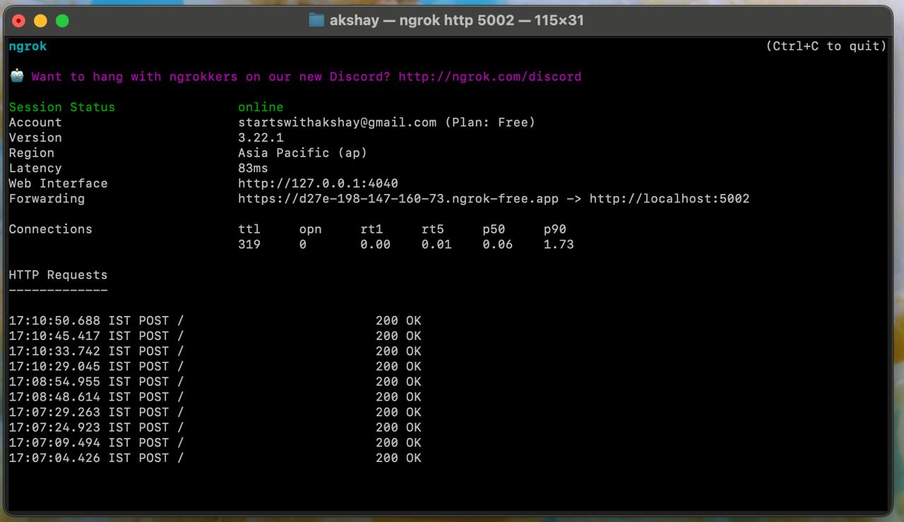

World-City Explorer -- Travel the World, One Message at a Time
      A Chat BOT that let's user type any city/country and get quick facts , nearby hubs , location data, population etc details.
      This helps one to learn fun facts aout places around the world in form of gamification.

Below details out how to start and get going with the World-City Explorer Chat BOT:

1. Download and install ngrok -> https://ngrok.com/downloads/
2. Create Authtoken Using following command -> ngrok config add-authtoken $YOUR_AUTHTOKEN
3. run app.py -> Python app.py
4. run ngrok server -> ngrok 5200 
5. Register the above Forwarding url as webhook -> https://v1-api.swiftchat.ai/api/bots/0211520332006026/webhook-url
6. Go to following bot url and fire away your city queries : https://cgweb.page.link/?link=https%3A%2F%2Fweb.convegenius.ai%3FbotId%3D0211520332006026&apn=ai.convegenius.app
